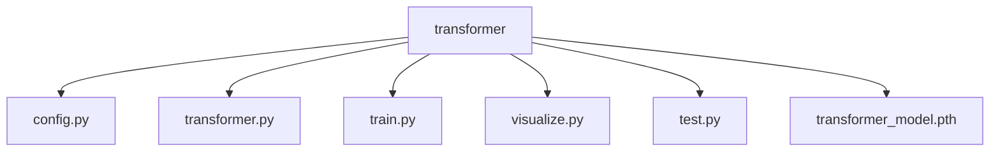
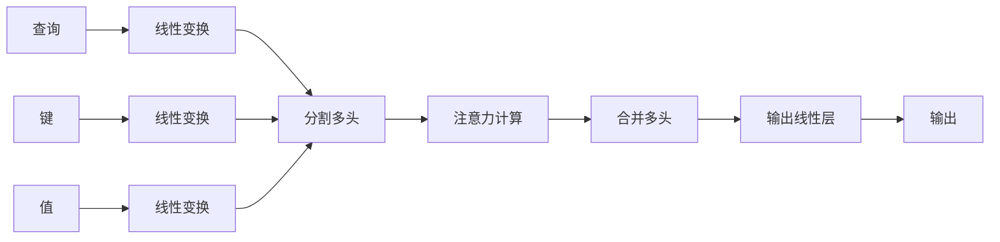
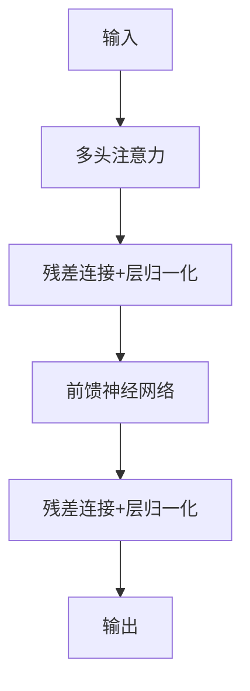
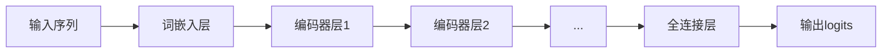
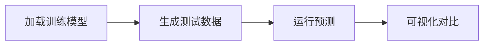

# Transformer 模型实现详解

本文档将详细解释当前文件夹下所有文件的运行逻辑和 Transformer 模型的实现过程。

## 项目文件结构



### 文件功能说明

1. **config.py** - 模型配置参数
2. **transformer.py** - Transformer 核心组件实现
3. **train.py** - 模型训练脚本
4. **visualize.py** - 预测可视化工具
5. **test.py** - 模型单元测试
6. **transformer_model.pth** - 训练好的模型权重

## Transformer 模型实现

### 核心组件

#### 1. 多头注意力机制 (MultiHeadAttention)



关键代码实现：
```python
class MultiHeadAttention(nn.Module):
    def __init__(self, d_model, num_heads):
        super().__init__()
        self.d_model = d_model
        self.num_heads = num_heads
        self.head_dim = d_model // num_heads
        self.wq = nn.Linear(d_model, d_model)
        self.wk = nn.Linear(d_model, d_model)
        self.wv = nn.Linear(d_model, d_model)
        self.dense = nn.Linear(d_model, d_model)
    
    def forward(self, q, k, v, mask=None):
        batch_size = q.size(0)
        q = self.wq(q)
        k = self.wk(k)
        v = self.wv(v)
        # 分割多头并计算注意力
        # ...
        return self.dense(output)
```

#### 2. 编码器层 (EncoderLayer)



关键代码实现：
```python
class EncoderLayer(nn.Module):
    def __init__(self, d_model, num_heads, dff, dropout=0.1):
        super().__init__()
        self.mha = MultiHeadAttention(d_model, num_heads)
        self.ffn = nn.Sequential(
            nn.Linear(d_model, dff),
            nn.ReLU(),
            nn.Linear(dff, d_model)
        )
        self.layernorm1 = nn.LayerNorm(d_model)
        self.layernorm2 = nn.LayerNorm(d_model)
        self.dropout = nn.Dropout(dropout)
    
    def forward(self, x, mask=None):
        attn_output = self.mha(x, x, x, mask)
        out1 = self.layernorm1(x + self.dropout(attn_output))
        ffn_output = self.ffn(out1)
        out2 = self.layernorm2(out1 + self.dropout(ffn_output))
        return out2
```

### 完整 Transformer 模型



## 训练流程 (train.py)

1. **数据生成**：使用 `generate_data` 函数创建随机训练数据
2. **模型初始化**：基于配置创建 Transformer 模型
3. **训练循环**：
   - 前向传播计算预测
   - 计算交叉熵损失
   - 反向传播更新权重
4. **模型保存**：训练完成后保存模型权重

关键训练代码：
```python
def train():
    config = Config()
    model = Transformer(config).to(device)
    criterion = nn.CrossEntropyLoss()
    optimizer = optim.Adam(model.parameters(), lr=config.lr)
    
    for epoch in range(config.epochs):
        inputs, mask = generate_data(config.batch_size, config.max_seq_len, config.vocab_size)
        outputs = model(inputs, mask)
        loss = criterion(outputs.view(-1, config.vocab_size), inputs.view(-1))
        optimizer.zero_grad()
        loss.backward()
        optimizer.step()
    
    torch.save(model.state_dict(), "transformer_model.pth")
```

## 可视化与预测 (visualize.py)

可视化模块展示模型预测效果：



可视化原理：
1. 将 token 序列转换为可读文本
2. 对比原始输入与模型预测
3. 计算预测准确率

## 单元测试 (test.py)

测试模块包含三个关键测试：
1. `test_multi_head_attention`：验证多头注意力机制输出形状
2. `test_encoder_layer`：验证编码器层输出形状
3. `test_transformer`：验证完整模型输出形状

测试命令：
```bash
python test.py
```

## 总结

本项目实现了一个简化版 Transformer 模型，包含：
- 多头注意力机制
- 编码器层（残差连接+层归一化）
- 端到端训练流程
- 预测可视化
- 单元测试

通过训练，模型可以学习复制输入序列的任务，展示了 Transformer 架构处理序列数据的能力。
